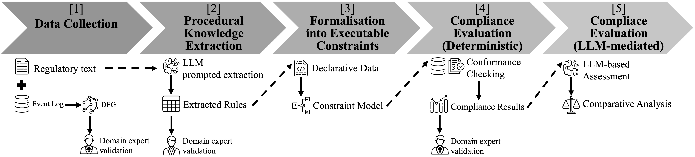

# CURIA Conformance Pipeline

Pipeline to extract procedural rules from CURIA regulatory text, transform them into a Declare model, run conformance checking on event logs, and produce impact/disagreement analyses with an LLM.

Regulatory reference:
https://eur-lex.europa.eu/IT/legal-content/summary/rules-of-procedure-of-the-court-of-justice-of-the-european-union.html

## Requirements

- Python 3.12 recommended
- Dependencies listed in `requirements.txt`
- `OPENAI_API_KEY` environment variable for LLM scripts

Quick setup:

```bash
python -m venv venv312
source venv312/bin/activate
pip install -r requirements.txt
```

## Pipeline



<em>Overview of the end-to-end CURIA conformance analysis pipeline.</em>

## Script Execution Order

Recommended end-to-end order:

1. `01_llm_text_to_rules.py`  
   Extracts workflow rules (JSON/CSV) from the regulatory PDF using an LLM.
   Input data: CURIA regulatory text source (PDF) from `curia_texts/` and prompt/configuration parameters in the script.
   Output data: rule extraction artifacts in `event_rules/`, including `workflow_rules.json`, `workflow_rules.csv`, and extraction prompt trace.

2. `02_declare_model.py`  
   Converts rules into an executable Declare model and generates build/validation reports.
   Input data: extracted rule set from `event_rules/workflow_rules.json` or `event_rules/workflow_rules.csv`.
   Output data: Declare model file and validation/build diagnostics in `declare_model/` (for example `curia_model.decl` and build report files).

3. `03_run_declare_conformance.py`  
   Runs Declare conformance checking on the event log and saves the matrix plus statistics.
   Input data: executable Declare model from `declare_model/` and event log data from `event_log/` (`.csv`/`.xes`).
   Output data: case-rule conformance matrix and aggregated statistics in `conformance_results/`.

4. `04_rule_impact_ranking.py`  
   Computes leave-one-rule-out impact per rule and produces ranking plus case-level scores.
   Input data: full conformance outputs from `conformance_results/`, especially per-case/per-rule compliance information.
   Output data: rule impact ranking and case-level compliance score files in `conformance_impact/`.

5. `05_llm_disagreement.py`  
   Compares LLM judgement vs deterministic labels on a balanced subset of case/rule pairs.
   Input data: deterministic conformance labels from `conformance_results/` and rules/context used to prompt the LLM.
   Output data: disagreement analysis tables and summaries in `llm_disagreement/` (mismatches, per-rule metrics, and run metadata).

Optional notebook:

- `00_log_analyser.ipynb`  
  Exploratory log analysis and diagnostics support (not required for the batch pipeline).

## Folder Organisation

Main logical structure:

- `curia_texts/`  
  Regulatory input (source PDF).

- `event_log/`  
  Event log inputs/intermediates (`.csv`, `.xes`).

- `event_rules/`  
  Extracted rules (JSON/CSV) and extraction prompt.

- `declare_model/`  
  Declare model `.decl` and build/validation reports.

- `conformance_results/`  
  Case/rule conformance outputs and aggregated statistics.

- `conformance_impact/`  
  Rule-impact ranking and case-level compliance scores.

- `llm_disagreement/`  
  Outputs for LLM vs deterministic conformance comparison.

## Key Outputs

- `event_rules/workflow_rules.json` and `event_rules/workflow_rules.csv`
- `declare_model/curia_model.decl`
- `conformance_results/conformance_results.csv`
- `conformance_impact/conformance_impact.csv`
- `llm_disagreement/llm_disagreement_results.csv`

## Operational Notes

- Scripts are configured via constants in each file's `CONFIGURATION`/`CONFIG` section.
- For reproducible runs, verify seeds and input/output paths before execution.

## Contact

For questions or collaboration requests, please contact: roberto.nai@unito.it